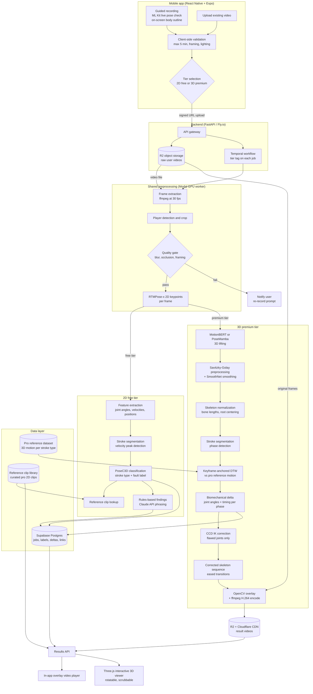

# CLAUDE.md - Spolysis: Tennis Motion Analysis Platform

This file is the master context for all agents working on this project.
Read it fully before writing any code.
All decisions below are final unless explicitly marked OPEN.
If something seems wrong or suboptimal, surface it with evidence and a recommended alternative - do not silently change direction.

## 1. What this project is

A mobile app that helps amateur tennis players improve their technique.
The user records themselves playing (max 5 minutes) through a guided in-app camera, and the system compares their motion against a dataset of professional players performing the same strokes, then shows them exactly what they are doing wrong and what the correction looks like on their own body.

Two tiers:

- **2D free tier**: classifies the stroke and the fault from 2D pose keypoints.
  Output is a plain-text coaching recommendation plus a curated short video clip of a professional performing the same motion correctly.
- **3D premium tier**: full monocular 3D reconstruction of the user's motion, phase-aligned comparison against professional reference motion, and a result that shows the user's own corrected skeleton overlaid on their original footage plus an interactive 3D viewer for scrubbing and rotating the correction.
  The user sees exactly where their body should have been - not a number like "30 degrees off."

The 3D tier is the hero product and the paid differentiator.
2D genuinely cannot see rotational faults (hip rotation, shoulder-to-hip separation) that happen in depth, so the visual correction is only trustworthy from 3D data.
Never present the tier split as an artificial gate.

## 2. Project constraints

This is a production application built to run at scale.
Every decision optimizes for long-term quality, scalability, and reliability.
Complexity of implementation is not a constraint.

Hard rules:

- **Pretrained models, fine-tuned where needed.** Training from scratch is not ruled out but must be justified against the fine-tuning path.
- **No iterative optimization-based body fitting (SMPLify-style) in the user-facing inference path.** 1-5 seconds per frame is unacceptable. Optimization fitting is permitted only offline for professional dataset curation.
- **Unit economics still matter.** Target $0.15-$0.50 per 5-minute premium analysis. This is why serverless GPU billing is used over always-on GPU infrastructure, not because of any simplicity preference.

## 3. Decided technology stack

| Layer | Decision | Notes |
|---|---|---|
| Mobile app | React Native (Expo Bare workflow) + react-native-vision-camera | Cross-platform; Expo adds EAS CI/CD and OTA updates |
| App CI/CD | Expo EAS (Application Services) | Automated builds and OTA updates for React Native |
| On-device recording check | ML Kit Pose Detection (live, both platforms) | Live green-state gate before recording is allowed; full body must be visible and correctly framed |
| 2D pose estimation (server) | RTMPose-x via MMPose | Maximum-accuracy variant; permissive license. Do NOT use YOLO pose (AGPL license). Do NOT use BlazePose server-side (degrades on fast tennis motion) |
| Stroke / fault classification | PoseC3D via MMAction2, fine-tuned on tennis data | Input: stacked 2D heatmap volumes from RTMPose-x - uses the full heatmap signal (not collapsed coordinates), making it more robust to occlusion and viewpoint variation. Same MMAction2/MMPose ecosystem as the rest of the pose pipeline. Do NOT use ST-GCN (coordinate-only input loses confidence signal). Training data: THETIS (8,374 clips, 12 stroke types) + Tennis-MoCap (weak fault labels from joint angle deltas between regular and high-performance players). Heuristic rule-based fallback active at launch while training set is assembled. All 4 stroke types (forehand, backhand, serve, volley) and all fault types supported from day one. |
| 3D pose lifting | MotionBERT and PoseMamba fine-tuned on SportsPose tennis sequences; winner deploys to production | Both are regression-based (fast inference). Fine-tune both on SportsPose tennis data (131 sequences, 24 subjects, COCO 17-joint format, Qualisys-validated 3D ground truth, 90 fps). The one with better accuracy on tennis motion wins. |
| Temporal smoothing | Savitzky-Golay (SciPy) preprocessing pass, then SmoothNet | SmoothNet understands human motion structure and gives best overlay quality; Savitzky-Golay removes gross noise first |
| Stroke segmentation | Heuristic wrist speed peaks for swing detection | Robust for racket sports; no training data needed |
| Temporal alignment | Keyframe-anchored DTW (anchor at wrist velocity peak / contact; constrained DTW on each side; Sakoe-Chiba band) | Libraries: dtaidistance or tslearn |
| IK correction | CCD with joint limits, applied only to flawed joints in the flawed window, eased in/out over a few frames each side | Rotation-based deltas map directly to CCD. Runs on CPU in milliseconds |
| Server-side overlay | OpenCV skeleton projection onto original frames + ffmpeg H.264 encode | Corrected skeleton composited over user's footage; distinct color and transparency |
| Interactive 3D viewer | Three.js in a WebGL view within the React Native app | Rotatable, scrubbable premium experience; part of Phase 3, not a future version |
| Recommendation text | Rules-based thresholds select findings; Claude API rephrases into natural coaching language | LLM only phrases - it never originates findings. Keeps output grounded in computed deltas |
| Job orchestration | Temporal | Durable workflows per pipeline run; activities per stage; automatic retries, timeouts, and full state visibility |
| Backend API | FastAPI (Python) on Fly.io | Always-on small instance; same language as ML pipeline |
| GPU compute | Modal (serverless) | Zero idle cost, per-second billing, Python-native. RunPod Serverless as fallback |
| Storage | Cloudflare R2 | Raw uploads, rendered result videos, reference clips. Zero egress fees |
| CDN | Cloudflare in front of R2 | |
| Database | Supabase (managed Postgres) | Users, jobs, labels, deltas, result links; Supabase Auth for authentication |
| Cache / rate limiting | Upstash Redis | Serverless Redis; job status caching, rate limiting on the API |
| Subscriptions | RevenueCat | In-app subscription management for iOS and Android premium tier |
| Push notifications | Expo Notifications (APNs + FCM) | Job completion alerts |
| Error tracking | Sentry (React Native + Python) | Unified error visibility across app and backend |
| Observability | OpenTelemetry + Grafana Cloud | Traces, metrics, dashboards for pipeline stages and API |
| LLM observability | LangFuse | Track Claude API call quality, latency, and cost |

## 4. Key product decisions

1. **Recording must happen inside the app** with an on-screen body outline and ML Kit live validation (upload of existing videos is also allowed but guided recording is the default path).
   This standardizes camera distance and angle, which solves camera calibration for the monocular 3D lifter.
   Treat the outline spec (distance, angle, side-on framing) as a real interface contract between the app and the ML pipeline.
2. **No GIFs.** The premium result is an overlaid video: the corrected skeleton composited over the user's original footage, visually distinct from their actual body.
3. **The correction is the user's own skeleton adjusted, never the pro's motion pasted on.** The pro has different limb lengths; overlaying their raw motion would look like a different body.
   The IK solver adjusts only the flawed joints toward target angles while preserving the user's bone lengths, and blends smoothly into their unmodified motion outside the flawed window.
4. **Free tier reference clips are a lookup, not generation.** Classification outputs (stroke type, fault label) index into a curated clip library.
   Start with one canonical clip per stroke type; expand to fault-specific clips based on observed fault frequency from real usage.
5. **Quality gate before any expensive compute.** Blurry, badly framed, or occluded videos are rejected after cheap preprocessing with a re-record prompt, before any 3D work runs.
6. **Social sharing from day one.** One-tap share of the correction clip or stroke snippet, privacy on by default.
   This is a proven growth lever that every competitor has neglected.

## 5. Pipeline architecture

**Shared front half (both tiers):**

```
video upload (signed URL to R2)
→ Temporal workflow enqueued with tier tag
→ Modal GPU worker: frame extraction (ffmpeg, 30fps)
→ player detection and crop
→ quality gate (fail → notify user, stop)
→ RTMPose-x 2D keypoints per frame
```

**Free tier branch:**

```
feature extraction (joint angles, velocities, normalized positions)
→ stroke segmentation (wrist velocity peaks)
→ PoseC3D classification (stroke type + fault label)
→ reference clip lookup
→ rules-based findings + Claude API phrasing
→ results DB
→ app: text + clip
```

**Premium tier branch:**

```
MotionBERT / PoseMamba 3D lifting
→ Savitzky-Golay preprocessing pass
→ SmoothNet smoothing
→ skeleton normalization (bone lengths, root centering)
→ stroke segmentation and phase detection (preparation, backswing, contact, follow-through)
→ keyframe-anchored DTW vs pro reference motion
→ biomechanical delta (joint angles + timing per phase)
→ CCD IK correction on user's skeleton (flawed joints only)
→ corrected sequence with eased transitions
→ OpenCV projected overlay onto original frames + ffmpeg H.264 encode
→ R2 + Cloudflare CDN
→ app: overlay video + Three.js interactive 3D viewer + rules + LLM text
```



## 6. Build phases

Work strictly in this order. Each phase must be demoable on a real device before the next starts.

**Phase 1 - 2D free tier, end to end.**
React Native app with ML Kit guided recording, upload, and results screen; FastAPI + Temporal backend; Fly.io deployment; R2 storage; RTMPose-x keypoints; PoseC3D classifier via MMAction2 (heuristic fallback at launch, fine-tuned on THETIS + Tennis-MoCap assembled in parallel); clip lookup for all 4 stroke types; rules-based + Claude API text output; RevenueCat paywall structure in place.
Scope: all strokes (forehand, backhand, serve, volley), all fault types, from day one.
Done when: a real phone-recorded video goes in and a stroke verdict, text recommendation, and reference clip come back unassisted on a real device.

**Phase 2 - 3D reconstruction and comparison, no rendering.**
MotionBERT and PoseMamba both integrated on Modal and fine-tuned on SportsPose tennis sequences (131 clips, COCO 17 joints, Qualisys-validated); SmoothNet smoothing; skeleton normalization; phase detection; DTW alignment vs Tennis-MoCap high-performance reference motion (BVH converted to COCO 17 joints, 5 high-performance players, all stroke types); delta computation.
Done when: for a test video the system outputs a numerically validated delta table (e.g. hip rotation at contact: user 34°, pro reference 52°) that is consistent with published tennis stroke biomechanics literature and validated against Tennis-MoCap high-performance reference values.
Validate numbers before touching any rendering.

**Phase 3 - Correction, overlay, and interactive viewer.**
CCD IK correction; eased blending; OpenCV projected overlay + ffmpeg encode; Three.js interactive 3D viewer in the app; CDN delivery; premium results screen; social sharing flow.
Done when: a user video comes back with a visibly correct corrected skeleton overlaid at the flawed moment (no jitter, no broken puppet artifacts), and the 3D viewer rotates and scrubs correctly.

**Phase 4 - Hardening and growth.**
Full observability rollout (Sentry + OpenTelemetry + Grafana Cloud + LangFuse); fault-specific reference clips (based on observed fault frequency from real usage); production benchmark between MotionBERT and PoseMamba on real tennis traffic; interactive viewer performance tuning on lower-end devices.

## 7. Competitive landscape

No public competitor ships the full 3D path: monocular lift to 3D, phase-aligned DTW vs pro, CCD IK correction on the user's own bone lengths, overlay on original footage.

| Competitor | What they ship | Gap vs this project |
|---|---|---|
| Tennis AI 2.0 | On-device MediaPipe/BlazePose; 107 metrics; side-by-side pro skeleton split-screen; 1.8 stars Android | 2D only; no IK-corrected overlay; poor reliability |
| sevensix | Cloud CV; stickman + "pro curve" overlay; score 1-100; iOS only; 4.2 stars | 2D / curve only; no 3D lift or IK |
| OffCourtz | Server-side parameter scoring; mentions "how you should have performed" overlay but FAQ admits placement is imperfect | Closest language but 2D implementation; no bone-length-preserving IK |
| SwingVision | ~500K users, ~$4M ARR; ball tracking, stats, highlights, line calling | Adjacent product (stats/highlights, not form correction); proves people pay for phone AI |

**Moat:** The only app that shows a user's own body, corrected, on their own footage.
Competitors sell scores, stickmen, and side-by-side comparisons.
Reliability is the shared failure mode of every competitor - the quality gate plus numerically validated deltas (against Tennis-MoCap high-performance reference and published stroke biomechanics) before rendering is the direct counter-strategy.

## 8. Repository layout

```
/app        React Native (Expo Bare)
/api        FastAPI backend
/pipeline   All ML: preprocessing, pose, lifting, alignment, IK, rendering - deployed to Modal
/data       Dataset curation scripts, clip library tooling, reference management
/docs       Architecture decisions, dataset inventory and notes, pipeline decisions
```

- Python 3.11+, typed (mypy), ruff for lint and format.
- Pipeline stages are pure functions: each stage takes typed inputs and returns typed outputs (dataclasses / Pydantic).
  Every stage is testable without video files.
- Every pipeline stage has a CLI entry point (`python -m pipeline.lift --input sample.mp4`).
- Keep model weights out of git; document download and setup in `/pipeline/README.md`.
- Store intermediate artifacts (keypoints, 3D sequences, deltas) as versioned JSON/NPZ in R2 keyed by job id, so later stages can be rerun without recomputing earlier ones.
- Never commit secrets; use environment variables; keep `.env.example` current.

## 9. Decided questions

- **Dataset for 3D lifter fine-tuning:** SportsPose tennis sequences (see §10). The professor's dataset is unavailable; SportsPose is the replacement.
- **Dataset for DTW reference motion:** Tennis-MoCap high-performance BVH files (5 high-performance players, all stroke types). Must be converted from BVH 23-joint to COCO 17-joint before use in pipeline.
- **Dataset for PoseC3D training:** THETIS (primary - 8,374 clips, 12 stroke types) + Tennis-MoCap (weak fault labels derived from joint angle deltas between regular and high-performance players). Heuristic fallback ships at Phase 1 launch while this is assembled.
- **Strokes at launch:** All four - forehand, backhand, serve, volley. Detect every fault across every stroke. The code already supports this.
- **Pricing:** Both pay-per-analysis and subscription are offered. Subscription is the promoted default (better LTV). Pay-per-analysis remains for low-commitment entry.
- **Platform priority:** iOS first.

## 10. Dataset inventory

All datasets used in the ML pipeline.
Agents must not use any dataset not listed here without surfacing it for review first.

### SportsPose (3D lifter fine-tuning)

- **Source:** github.com/ChristianIngwersen/SportsPose
- **Role:** Fine-tuning data for MotionBERT and PoseMamba
- **Tennis coverage:** 131 sequences × 24 subjects; every sequence is shape (270, 17, 3) at 90 fps
- **Format:** NPY arrays, COCO 17-joint skeleton - same format RTMPose-x outputs; no skeleton conversion needed
- **Ground truth:** Validated against Qualisys marker-based system, 34.5mm mean error
- **Status:** Partially downloaded (SportsPose.zip in repo root, 9.9 GB). Central directory truncated due to incomplete download; re-download before use. Raw data files inside are intact and readable by scanning from the start of the archive.
- **Not suitable for:** DTW reference motion (subjects are non-professional; tennis stroke types within sequences are not labeled by stroke type)

### Tennis-MoCap (DTW reference motion)

- **Source:** github.com/jdpulgarin/Tennis-MoCap (CC BY-SA 3.0)
- **Role:** High-performance reference motion for DTW alignment in Phase 2 and Phase 3
- **Coverage:** 17 players (5 high-performance, 12 regular) from Caldas-Colombia tennis league; all 6 stroke types: serve, smash, forehand groundstroke, forehand volley, backhand groundstroke, backhand volley; labeled in labels.csv
- **Format:** BVH files, 23 joints; labels.csv with stroke type (0-5), performance tier (0/1/2), gender per file
- **Status:** Public on GitHub, ~76 MB, downloadable now
- **Conversion required:** BVH 23-joint to COCO 17-joint mapping before use in pipeline
- **Usage rule:** Use only performance label = 1 or 2 files as DTW reference. Regular player files (label = 0) are negative/fault examples for ST-GCN weak labeling only.
- **Limitation:** "High-performance" is top of a regional Colombian league, not ATP/WTA level. Acceptable for Phase 2 numerical validation. Upgrade path: 3DTennisDS (Vicon, 10 pro players, pending author contact) before Phase 3 ships if delta accuracy is insufficient.

### THETIS (PoseC3D training - primary)

- **Source:** github.com/THETIS-dataset/dataset - free, no registration, ~13 GB
- **Role:** Primary training corpus for PoseC3D stroke and fault classification
- **Coverage:** 8,374 clips, 12 tennis stroke types, 55 players (p1-p31 beginner, p32-p55 expert); modalities: RGB, depth, silhouette, skeleton visualization
- **Stroke types (12):** backhand, backhand (two-handed), backhand slice, backhand volley, forehand flat, forehand open stance, forehand slice, forehand volley, flat service, kick service, slice service, smash
- **Labels:** Stroke type only - no explicit fault labels. Beginner/expert split embedded in filename (subject index).
- **Format:** AVI video clips at 320x240, 30 fps, ~2-5 seconds per clip. Skeleton modality is rendered video (not raw coordinates) - raw COCO-17 keypoints must be re-extracted from RGB clips using RTMPose-x.
- **PoseC3D input pipeline:** THETIS RGB clips → RTMPose-x → COCO-17 keypoints → MMAction2 annotation pickle (`[M, T, V, 2]` array + confidence scores per clip). MMAction2 provides extraction tooling.
- **Fault label strategy:** No explicit fault labels exist in any public dataset. Weak fault labels derived by computing joint angle deltas between beginner subjects (p1-p31) and expert subjects (p32-p55) in THETIS, cross-validated against Tennis-MoCap high-performance reference motion.
- **Status:** Confirmed downloadable. Not yet downloaded.

### CalTennis (supplementary)

- **Source:** HuggingFace
- **Role:** Supplementary PoseC3D training data and possible Phase 2 fine-tuning supplement
- **Coverage:** 51 hours, 11M+ frames, multi-view 3D, 40 players
- **Status:** Identified, not yet downloaded. Download when THETIS alone is insufficient.

### 3DTennisDS (future upgrade - pending)

- **Source:** Contact authors (pending)
- **Role:** Potential upgrade for DTW reference motion - 10 professional players, Vicon MoCap, 39 markers
- **Status:** Access pending author contact. Do not block Phase 2 or Phase 3 on this. Tennis-MoCap is the working reference until this is secured.
