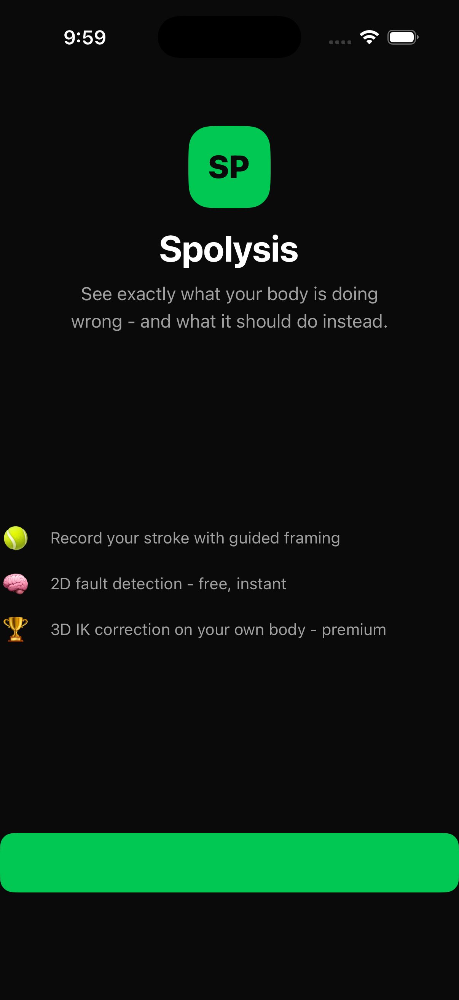
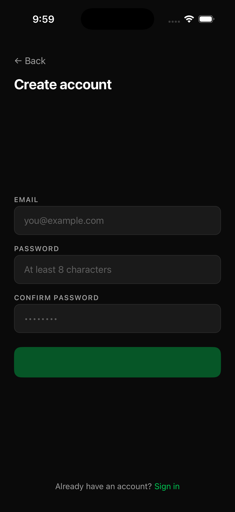
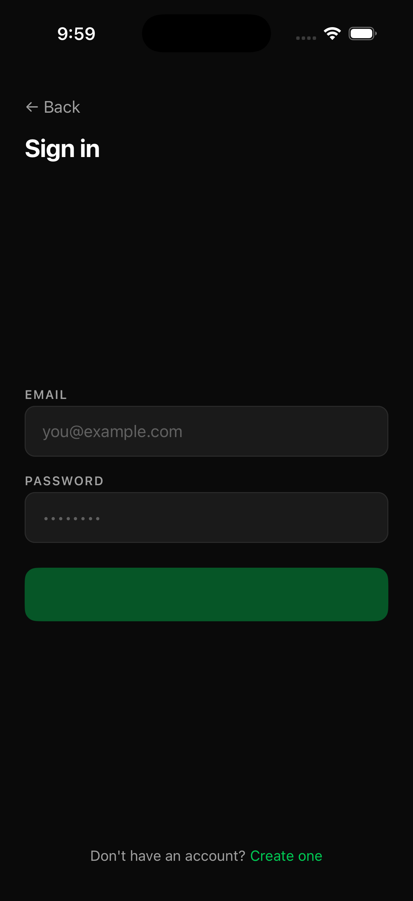

# Spolysis - Tennis Motion Analysis Platform

Spolysis is a mobile application that helps amateur tennis players improve their technique by showing them exactly what their body is doing wrong - and what it should do instead - on their own footage.

A user records themselves playing through a guided in-app camera.
The system compares their motion against a dataset of professional players performing the same strokes, then delivers a precise correction overlaid on their original video.

## Live demo - running on iOS simulator

<p align="center">
  
  &nbsp;&nbsp;
  
  &nbsp;&nbsp;
  
</p>

*Running on iPhone 17 Pro simulator, iOS 26.5. Dark theme throughout.*

## What makes this different

Every tennis analysis app on the market today gives you scores, stickmen, or a side-by-side comparison with a professional.
Spolysis gives you your own body, corrected, on your own footage.

The correction is not the pro's motion pasted on - the pro has different limb lengths and that would look wrong.
Instead, the system computes the exact joint-angle deltas between what the user did and what they should have done, then applies those corrections to the user's own skeleton using an IK solver that preserves their bone lengths.
The result is a video of what the user's body specifically should have looked like.

This is only possible with a full 3D reconstruction pipeline.
The free tier uses 2D pose estimation and can catch common faults visible in-plane (low follow-through, late contact, open stance).
The premium tier does a full monocular 3D lift, phase-aligned DTW comparison against professional reference motion, CCD IK correction, and renders the corrected skeleton composited over the user's original footage.

## Tier structure

**Free (2D)**
- Guided in-app recording with live pose validation
- RTMPose-x 2D pose estimation
- PoseC3D stroke classification (forehand / backhand / serve / volley) and fault detection
- Plain-text coaching recommendation (Claude API phrased, rules-based findings)
- Curated reference clip of a professional performing the correct motion

**Premium (3D)**
- Everything in the free tier
- Monocular 3D reconstruction (MotionBERT / PoseMamba, winner selected after validation)
- Phase detection (preparation, backswing, contact, follow-through)
- Keyframe-anchored DTW alignment against professional reference motion
- Biomechanical delta computation (joint angles and timing per phase)
- CCD IK correction applied only to flawed joints, eased in/out over neighboring frames
- Corrected skeleton rendered over original footage (OpenCV + ffmpeg H.264)
- Interactive 3D viewer (Three.js) - rotate and scrub the correction

## Current state

### Where we are

Phase 1 code is complete end-to-end.
All screens, all backend endpoints, all Modal pipeline stages, Temporal workflow, and results screen are built and committed.
The codebase is in a runnable state.

We are in the middle of the first device test - Xcode is being installed and the iOS simulator build will run next.
The three remaining steps before the first real analysis comes back are:

1. **Simulator smoke test** - build and run on iOS simulator, confirm app loads and camera screen works.
2. **Infrastructure provisioning** - Supabase (database + auth), Cloudflare R2 (storage), Upstash Redis (cache), Temporal Cloud (workflow engine) all need to be provisioned and secrets wired up.
3. **Reference clips** - one canonical reference clip per stroke type must be extracted from THETIS expert players and uploaded to R2.
   Script is at `data/scripts/prepare_reference_clips.py`.
   THETIS must be downloaded first (~13 GB, public).

Phase 2 architecture is fully designed.
The 3D pipeline stages are not yet implemented.
The Tennis-MoCap BVH-to-COCO-17 conversion is complete: 25 NPY reference sequences are in `data/reference_motion/` covering all 4 stroke types from 4 high-performance players.

### What is built

| Layer | Status |
|---|---|
| React Native app (Expo Bare) | Complete - all screens, navigation, camera, upload, result display |
| FastAPI backend (Fly.io) | Complete - auth, signed uploads, job status, internal callbacks |
| Temporal workflow orchestration | Complete - durable per-job workflow with retries and timeouts |
| Modal GPU pipeline | Complete - all stages wired end to end, A10G, deployed |
| 2D pose estimation (RTMPose-x) | Complete - weights auto-download on first cold start |
| Stroke + fault classifier (PoseC3D) | Architecture complete; heuristic fallback ships now; awaiting THETIS training data |
| Coaching text (Claude API) | Complete |
| Reference clip lookup | Complete - indexes by stroke type + fault label |
| Supabase auth + database | Schema complete; awaiting provisioning |
| Cloudflare R2 storage | Integrated; awaiting provisioning |
| RevenueCat subscriptions | Integrated; awaiting product configuration |
| Tennis-MoCap reference motion | BVH conversion done - 25 NPY sequences in data/reference_motion/ |
| EAS build configuration | Complete - simulator and production profiles configured |

### What is not yet built or done

- [ ] iOS simulator build passing end-to-end
- [ ] Infrastructure provisioned (Supabase, R2, Upstash, Temporal Cloud)
- [ ] Reference clips extracted from THETIS and uploaded to R2
- [ ] PoseC3D trained weights (blocked on THETIS download + RTMPose-x keypoint extraction)
- [ ] Phase 2: 3D lifting stages (MotionBERT / PoseMamba fine-tune on SportsPose tennis data)
- [ ] Phase 2: DTW alignment, delta computation against Tennis-MoCap reference
- [ ] Phase 3: CCD IK correction, OpenCV overlay render, ffmpeg H.264 encode
- [ ] Phase 3: Three.js interactive 3D viewer in the app
- [ ] Phase 4: Sentry + OpenTelemetry + Grafana Cloud + LangFuse observability

## Training data status

| Dataset | Role | Status |
|---|---|---|
| **THETIS** | PoseC3D training - 8,374 clips, 12 stroke types, 55 players | Public; not yet downloaded (~13 GB) |
| **Tennis-MoCap** | DTW reference motion - 5 high-performance players, all strokes | Downloaded; BVH conversion done; 25 NPY sequences ready |
| **SportsPose** | 3D lifter fine-tuning - 131 tennis sequences, Qualisys-validated | Partially downloaded (zip incomplete; re-download needed) |
| **CalTennis** | Supplementary PoseC3D training - 51 hours, 11M+ frames, multi-view 3D | Identified; download when THETIS alone is insufficient |
| **3DTennisDS** | Upgrade for DTW reference motion - 10 pro players, Vicon MoCap | Author contact pending; not blocking Phase 2 |

**Fault label gap:** No public dataset has frame-level fault annotations.
Weak fault labels for PoseC3D training are derived by comparing joint angle deltas between THETIS beginner subjects (p1-p31) and expert subjects (p32-p55), cross-validated against Tennis-MoCap high-performance reference.

## Architecture overview

```
Mobile app (React Native + Expo Bare)
  ├── Guided recording screen with body outline overlay
  ├── ML Kit live pose validation gate (on-device, before recording starts)
  └── Upload to Cloudflare R2 via signed URL

FastAPI backend (Fly.io)
  ├── Supabase auth (JWT)
  ├── Job creation + R2 presigned URLs
  ├── Temporal workflow trigger
  └── Internal callback endpoints (pipeline → API)

Temporal Cloud (durable orchestration)
  └── Chains pipeline activities with automatic retries and timeouts

Modal GPU pipeline (serverless A10G, per-second billing)
  ├── Frame extraction (ffmpeg, 30fps)
  ├── Player detection + crop
  ├── Quality gate (blur, framing, occlusion) - reject before expensive compute
  ├── RTMPose-x 2D keypoints per frame
  ├── Feature extraction (joint angles, velocities, normalized positions)
  ├── Stroke segmentation (wrist velocity peak detection)
  ├── PoseC3D classification (stroke type + fault label)
  ├── Reference clip lookup
  └── Claude API coaching text (Haiku - phrases findings, does not originate them)

Cloudflare R2 + CDN
  └── Raw uploads, result videos, reference clips, intermediate artifacts (keyed by job_id)
```

## Technology choices and rationale

**2D pose: RTMPose-x via MMPose** - maximum accuracy variant with permissive license.
YOLO pose (AGPL) and BlazePose server-side (degrades on fast tennis motion) are explicitly excluded.

**Stroke classification: PoseC3D via MMAction2** - input is stacked RTMPose-x heatmap volumes, not collapsed coordinates.
The full heatmap signal is more robust to occlusion and viewpoint variation than coordinate-only models.
ST-GCN is explicitly excluded because it loses the per-joint confidence signal by collapsing to coordinates.

**3D lift: MotionBERT and PoseMamba** - both are regression-based (fast inference, no iterative optimization).
Both will be fine-tuned on SportsPose tennis sequences; the one with better accuracy on tennis motion deploys to production.
SMPLify-style iterative fitting is explicitly excluded from the user-facing path (1-5 seconds per frame is unacceptable).

**Temporal smoothing: Savitzky-Golay + SmoothNet** - SG removes gross noise first; SmoothNet understands human motion structure and gives best overlay quality.

**DTW alignment: keyframe-anchored DTW** - anchor at wrist velocity peak / contact point; constrained DTW on each side with Sakoe-Chiba band.
This handles the timing variation between amateur and professional strokes reliably.

**IK correction: CCD with joint limits** - rotation-based deltas map directly to CCD; fast CPU execution in milliseconds; applied only to flawed joints in the flawed window; eased in/out over neighboring frames to avoid puppet artifacts.

**Rendering: OpenCV skeleton projection + ffmpeg H.264** - corrected skeleton composited over original frames; visually distinct color and transparency.

**Orchestration: Temporal** - durable workflow per pipeline run; every stage is an activity with retries and timeouts; full state visibility.

**GPU compute: Modal (serverless)** - zero idle cost, per-second billing on A10G.
Target unit economics: $0.15-$0.50 per 5-minute premium analysis.

**Coaching text: Claude API (Haiku)** - LLM only rephrases findings; it never originates them.
Rules-based thresholds select findings from computed deltas; Claude puts them in natural coaching language.

## Repository structure

```
/app        React Native app (Expo Bare)
/api        FastAPI backend
/pipeline   ML pipeline - all stages, models, Temporal workflow - deployed to Modal
/data       Dataset curation scripts, clip library tooling, reference motion management
/docs       Architecture decisions, dataset notes, cost breakdown, screenshots
```

## Getting started

### Prerequisites

| Tool | Version | Install |
|---|---|---|
| Node.js | 18+ | nodejs.org |
| Xcode | 15+ | Mac App Store |
| CocoaPods | 1.15+ | `brew install cocoapods` |
| Python | 3.11+ | python.org |
| Modal | latest | `pip install modal` |
| Expo CLI | latest | `npm install -g expo-cli` |

### 1. Clone and install

```bash
git clone https://github.com/Susanpdl/spolysis.git
cd spolysis
```

Install app dependencies:

```bash
cd app
npm install
```

Install pipeline dependencies:

```bash
cd ../pipeline
pip install -r requirements.txt
```

### 2. Environment variables

Copy the example env file and fill in your credentials:

```bash
cp .env.example .env
```

Required variables (see `.env.example` for the full list):

| Variable | Where to get it |
|---|---|
| `SUPABASE_URL` | Supabase project settings |
| `SUPABASE_SERVICE_KEY` | Supabase project settings > API |
| `SUPABASE_ANON_KEY` | Supabase project settings > API |
| `R2_ACCOUNT_ID` | Cloudflare dashboard |
| `R2_ACCESS_KEY_ID` | Cloudflare R2 > Manage API tokens |
| `R2_SECRET_ACCESS_KEY` | Cloudflare R2 > Manage API tokens |
| `R2_BUCKET_NAME` | Your R2 bucket name |
| `ANTHROPIC_API_KEY` | console.anthropic.com |
| `TEMPORAL_ADDRESS` | Temporal Cloud namespace connection string |
| `TEMPORAL_NAMESPACE` | `spolysis.kwkvd` |
| `INTERNAL_API_SECRET` | Any random secret string shared between API and pipeline |

Upload the env file as a Modal secret named `spolysis-secrets`:

```bash
modal secret create spolysis-secrets $(cat .env | xargs)
```

### 3. Run the iOS app on simulator

```bash
cd app
npx expo run:ios
```

This runs `expo prebuild`, installs CocoaPods, compiles with Xcode, and launches on the iOS simulator.
First build takes 5-10 minutes; subsequent builds are fast.

Note: the camera screen shows errors on simulator - that is expected.
The iOS simulator has no real camera; the recording screen will work on a real device.

### 4. Run the backend API locally

```bash
cd api
pip install -r requirements.txt
uvicorn main:app --reload --port 8000
```

### 5. Deploy the pipeline to Modal

```bash
modal deploy pipeline/app.py
```

This builds the GPU Docker image (takes ~10 minutes the first time due to OpenMMLab compilation) and deploys the pipeline function and Temporal worker to Modal.

### 6. Run the Temporal worker

The Temporal worker runs as a long-lived Modal function:

```bash
modal run pipeline/app.py::run_temporal_worker
```

Or it starts automatically after `modal deploy` if you trigger it via the Modal dashboard.

### 7. Prepare reference clips (Phase 1 only)

Download THETIS (~13 GB, public):

```bash
# Follow instructions at github.com/THETIS-dataset/dataset
```

Then extract one canonical clip per stroke type from expert players (p32+):

```bash
python data/scripts/prepare_reference_clips.py
```

Upload to R2:

```bash
aws s3 cp data/clips/reference/ s3://your-bucket/clips/ \
  --recursive \
  --endpoint-url https://<account-id>.r2.cloudflarestorage.com
```

For the full pipeline setup guide including model weights, training instructions, and per-stage CLI entry points, see `/pipeline/README.md`.

## Build phases

**Phase 1 (current) - 2D free tier end to end**
Done when: a real phone-recorded video goes in and a stroke verdict, text recommendation, and reference clip come back on a real device.
Status: code complete; next step is iOS simulator test, then infrastructure provisioning, then reference clips.

**Phase 2 - 3D reconstruction and comparison, no rendering**
Done when: for a test video the system outputs a numerically validated delta table (e.g., hip rotation at contact: user 34 degrees, pro reference 52 degrees) that is consistent with published tennis stroke biomechanics literature and validated against Tennis-MoCap high-performance reference values.
Validate numbers before touching any rendering.
Status: architecture designed; Tennis-MoCap reference motion converted and ready; 3D pipeline stages not yet implemented; SportsPose fine-tune not yet run.

**Phase 3 - Correction, overlay, and interactive viewer**
Done when: a user video comes back with a visibly correct corrected skeleton overlaid at the flawed moment, no jitter, no puppet artifacts, and the 3D viewer rotates and scrubs correctly.
Status: not started.

**Phase 4 - Hardening and growth**
Full observability rollout (Sentry + OpenTelemetry + Grafana Cloud + LangFuse), fault-specific reference clips based on observed fault frequency from real usage, production benchmark between MotionBERT and PoseMamba, interactive viewer performance tuning.
Status: not started.

## Competitive landscape

| Competitor | What they ship | Gap |
|---|---|---|
| Tennis AI 2.0 | On-device MediaPipe; 107 metrics; side-by-side pro skeleton; 1.8 stars Android | 2D only; no IK-corrected overlay; unreliable |
| sevensix | Cloud CV; stickman + pro curve overlay; iOS only; 4.2 stars | 2D / curve only; no 3D lift or IK |
| OffCourtz | Parameter scoring; "how you should have performed" overlay | Closest language but 2D; no bone-length-preserving IK |
| SwingVision | ~500K users, ~$4M ARR; ball tracking, stats, highlights | Adjacent product (stats, not form correction); proves people pay |

No public competitor ships the full path: monocular 3D lift - phase-aligned DTW - CCD IK correction on the user's own bone lengths - overlay on original footage.
